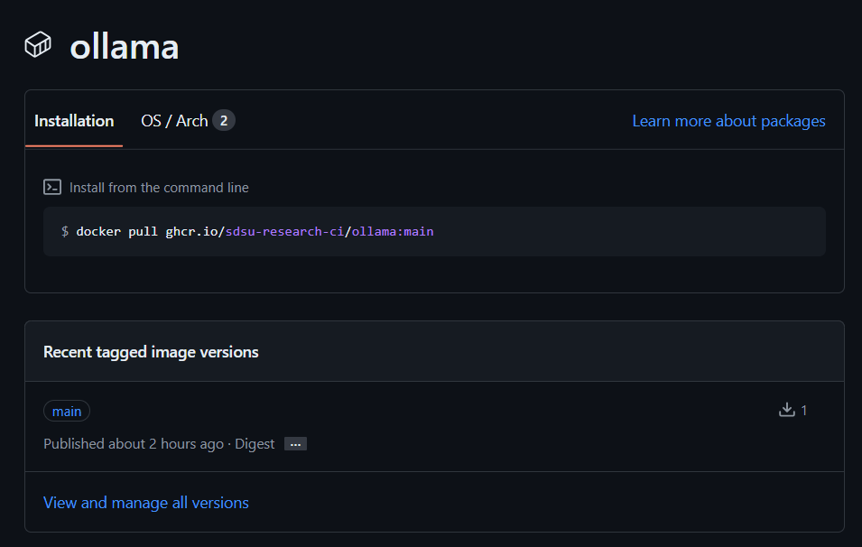
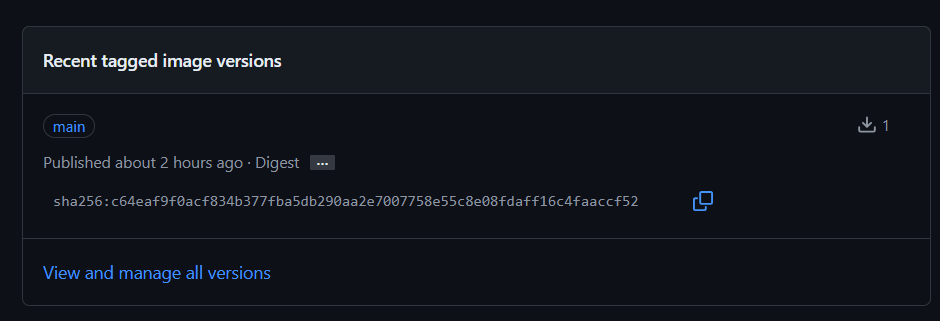

# Ollama Deployment

This Kubernetes deployment runs [Ollama](https://github.com/ollama/ollama).

This builds upon the [official Ollama Dockerfile](https://hub.docker.com/r/ollama/ollama).

## Customizing the Deployment
Before following the steps in these sub-sections, please clone this repo to your local computer:
- Cloning over HTTPS: `git clone https://github.com/SDSU-Research-CI/ollama-deployment.git`
- Cloning over SSH: `git clone git@github.com:SDSU-Research-CI/ollama-deployment.git`

### Updating the Container Image
1. Open the Dockerfile
1. You should see the image from [Ollama's official docker image](https://hub.docker.com/r/ollama/ollama)
    - I.E. `FROM ollama/ollama:0.1.48`
    - You can peruse the tags for the latest version, which was 0.1.48 at the time of writing.
    - Note: The -rocm versions will not work with our CUDA GPUs
    - Note: Using the "latest" tag is not recommended because images are cached on cluster nodes based on the tag to save time downloading images
1. Update the tag following the colon (":")
1. Run `git add .`
1. Run `git commit -m "Updated Ollama to latest"`
1. Run `git push -u origin main`

This will trigger a CI/CD pipeline that will build the latest image.
You can track the build progress via the [Actions tab](https://github.com/SDSU-Research-CI/ollama-deployment/actions) on the repo.
If the build is successful, the build will display a green checkmark next to it.

Continue to the next session to update the image that the deployment is using.

### Updating the Kubernetes Manifest File
1. Find the latest container image on the [packages](https://github.com/SDSU-Research-CI/ollama-deployment/pkgs/container/ollama) link from the home of the repo.
1. Click the "..." under the main tag to reveal the sha256 value
    - 
1. Copy the sha256 value using the copy icon
    - 
1. Open the manifest.yaml
1. Under the containers section, find the pod-ollama's `image:` line (at the time of writing on line 30)
1. Replace the sha256 value after the @ sign
    - I.E: `image: ghcr.io/sdsu-research-ci/ollama@sha256:c64eaf9f0acf834b377fba5db290aa2e7007758e55c8e08fdaff16c4faaccf52`
1. Save the file
1. Run `git add .`
1. Run `git commit -m "Updated Ollama pod container image to latest"`
1. Run `git push -u origin main`

Continue to the next section to deploy your changes.

### Deploying Changes
The following steps require that you have been added to the namespace "sdsu-aicenter".
To get access, please follow the [Getting Access guide](https://sdsu-research-ci.github.io/softwarefactory/gettingaccess).

1. Download and install [kubectl](https://kubernetes.io/docs/tasks/tools/#kubectl)
1. Check for your config file
    - `ls ~/.kube/config`
    - If nothing is found, please follow the instructions from the [Getting Access - NRP Portal tasks section](https://sdsu-research-ci.github.io/softwarefactory/gettingaccess#nrp-portal-tasks)
1. From your terminal, navigate to the root directory of this repo
1. Run `kubectl -n sdsu-aicenter delete -f manifest.yaml`
1. Run `kubectl -n sdsu-aicenter get pods --watch`
    - Wait until you see the READY column showing 0/2 for the Ollama-XXXXXXXX-XXXX pod
    - Exit the watch command with `ctrl + c`
1. Run `kubectl -n sdsu-aicenter apply -f manifest.yaml`
1. Run `kubectl -n sdsu-aicenter get pods --watch`
    - Wait until you see the READY column showing 2/2 for the new Ollama-XXXXXXXX-XXXX pod
    - Exit the watch command with `ctrl + c`
1. Optionally, get a shell on the pod and run ollama list to verify which models are downloaded or ollama pull to download new models:
    ```
    kubectl -n sdsu-aicenter exec -it [ollama-pod] -- bash
    ollama list
    ollama pull [model-name]
    ollama run [model-name]
    ```
    - Note: replace "[ollama-pod]" with the name of the currently running pod and remove the square brackets
    - Note: replace "[model-name]" with the name of the model

At this point, the ollama instance is available via API from campus and VPN ip addresses with an API token (RCI has provided these and can share as needed).
